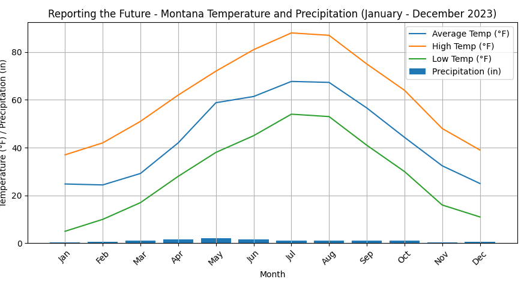

# Reporting the Future

## Average temp/typical weather (beginning of the 21st century)

*   Average temps:
    *   Summer (June-August): 
        * Days were warm and sunny, with average highs around 78°F (26°C) and lows dipping to a crisp 50°F (10°C).
    *   Winter (December-February): 
        * Things got chillier, with average highs hovering around 35°F (1°C) and lows plunging to 15°F (-9°C). Snowfall was a regular visitor, blanketing Montana in a white coat turning the ski slopes into a winter wonderland.
    *   Spring (March-May) and Fall (September-November):
        * These seasons were transitional periods, with temperatures fluctuating between the extremes of summer and winter. Spring brought gentle thaws and the promise of blooming wildflowers, while fall painted the landscape in warm hues of orange, red, and yellow.

*   Typical weather:
    *   Sunshine:
        * Montana enjoyed an average of 300 sunny days per year, making it a bright and cheerful place to live
    *   Precipitation:
        * Rainfall averaged around 14 inches annually, spread fairly evenly throughout the year. The occasional thunderstorm could roll though, but most rain arrived gently, nourishing Montana without causing floods
    *   Wind:
        * Montana wasn’t known for its strong winds, with breezes usually being mild and pleasant.

---
Average temp/typical weather (2100):

*   Average temps:
    *   Summer (June-August): 
        * Average highs soar to a searing 95°F (25°C), with heat waves pushing the mercury past 110°F (43°C).
    *   Winter (December-February): 
        * Winters have become shorter and milder, with average highs hovering around 45°F (7°C) and lows rarely dipping below 20°F (-7°C). Snowfall is a rare visitor, replaced by sporadic rain showers that offer little respite from the overall aridity.
    *   Spring (March-May) and Fall (September-November): 
        * The shoulder seasons have morphed into extended periods of summer-like heat, with temperatures often exceeding 80°F (27°C) even in March and November. Forget the gradual transitions of the past; 2100 throws you straight into sweltering heat or bone-dry chills, with barely a breath of spring or fall in between.

*   Precipitation:
    *   Goodbye steady rains: 
        * The dependable rainfall patterns of 2024 are a distant memory. Erratic weather dominates, with long stretches of drought punctuated by sudden, intense downpours that cause flash floods and wreak havoc on the parched land.
    *   Welcome, dust storms: 
        * Prepare for a sky choked with dust. The lack of regular rainfall and increased frequency of droughts have turned the fertile plains into tinderboxes, prone to vicious dust storms that whip across the landscape, carrying particles that clog lungs and turn day into a surreal, orange twilight.

*   Weather events:
    *   Heatwaves: 
        * These are no longer fleeting inconveniences. Extended periods of scorching temperatures, often lasting weeks, become a regular occurrence, straining infrastructure, impacting health, and forcing drastic adaptations to daily life.
    *   Wildfires: 
        * The ever-present dryness and intense heat create a perfect recipe for wildfires. These infernos rage with unprecedented ferocity, devouring vast swathes of land and spewing smoke that casts a pall over the region for weeks.
    *   Flash floods:
        * When the rain finally arrives, it often comes in concentrated bursts, overwhelming the parched earth and leading to sudden, destructive flash floods. These torrents carve through canyons inundate roads, and threaten communities that were once miles from any major body of water.

## Actions taken to prevent global warming:
*   Renewable energy revolution:
    *   Solar, wind, and geothermal power boom, displacing fossil fuels. Cities now have rooftop solar panels, wind farms dot landscapes, and geothermal plants harness the Earth’s energy. This shift greatly reduced the greenhouse gas emissions, though dependence on fossil fuels in some sectors like heavy industry still lingered.

*   Energy efficiency push:
    *   Buildings became smarter, with automated systems optimizing energy use. Homes have been insulated to perfection, appliances became energy efficient marvels, and smart grids distributed power more intelligently. This reduced overall power consumption, further curbing emissions.

*   Transportation:
    *   Electric vehicles (EVs) became the norm, and dominate roads. Charing infrastructure has blossomed, which has made EVs a convenient and sustainable choice of transportation. Public transportation systems expanded, offering efficient alternatives to private transportation such as cars. These shifts slashed emissions from the transportation sector, once a major culprit.

*   Carbon capture and storage
    *   Technologies to capture and store carbon emissions from the atmosphere were developed and deployed. Forests were actively protected and restored, acting as natural carbon sinks. While still in their early stages, these efforts offered a path to removing existing carbon emissions from the atmosphere, slowly mitigating the effects of past warming.

*   Challenges and remaining actions:
    *   Despite these efforts, the 2100 world still reflects the consequences of global warming. The rate of change has been slowed, but complete reversal was proven elusive. Challenges like inertia in certain industries, rising populations, and extreme weather events still pose challenges.

## Factors changing climate/prevent it from changing:

*   Natural Cycles:

    *   Solar activity:
        * The sun's output fluctuated over the decade. While the overall trend was towards increased warming, periods of low solar activity might have temporarily slowed the increase in global temperatures.
    *   Volcanic eruptions:
        * Major volcanic eruptions can insect large amounts of dust and aerosols into the atmosphere, temporarily reflecting sunlight back into space, cooling the earth.
    *   Ocean currents: 
        * Changes in ocean currents, like the Atlantic Meridional Overturning Circulation (AMOC), can disrupt heat distribution and influence regional climates. While significant shifts in AMOC haven’t been definitively observed yet, its potential impact is closely monitored.

## Mars Situation:

*   By 2100, a thriving Martian colony, christened “Nova Terra” in 2050,  hums with life. Nestled in the Valles Marineris canyon, shielded by advanced domes and intricate life-support systems, Nova Terra stands as a testament to human ingenuity and perseverance.
*   Challenges and Solutions:
    *   The harsh, Martian environment: 
        * Radiation, extreme temperatures, and a thin atmosphere posed formidable challenges. To combat these, colonists live in pressurized habitats with advanced radiation shielding and temperature regulation systems. They utilize innovative greenhouses and aquaponics systems for sustainable food production, carefully managing precious water resources.
    *   Psychological strain and isolation: 
        * Living in a confined environment, millions of kilometers from Earth, is quite mentally taxing for some. To address this, colonists have access to advanced virtual reality technology and robust psychological support systems. They foster a strong community spirit, celebrating shared milestones and cherishing the unique Martian landscape.
    *   Technical hurdles and resource limitations:
        * Building and maintaining a self-sustaining colony on Mars required constant innovation. 3D printing technology played a crucial role in constructing habitats and infrastructure using locally sourced materials. Resource extraction and recycling became vital, minimizing reliance on Earth for supplies.

*   The greatest challenges:
    *   Terraforming:
        * Transforming Mars into a fully Earth-like environment proved a long-term endeavor. While advances in atmospheric manipulation and genetic engineering offered hope, the process remains slow and requires careful monitoring to avoid unforeseen consequences.
    *   Maintaining economic stability:
        * Establishing a self-sufficient economy on Mars was a complex challenge. Space tourism and research projects provided initial revenue streams, but long-term sustainability required developing unique Martian resources and industries, like asteroid mining and specialized agriculture.

*   Population:

    *   Total: ~20,000
        *   Elders (65+): ~1,500
        *   Adults (18-64): ~10,000
        *   Children (5-17): 9,000
        *   Babies (0-4): ~700 newborns each year

    *   Waves of population:
        *   Early Waves (2050-2070):
            *   1st ship (2050): 20 passengers
            *   2nd ship (2057): 40 passengers
            *   3rd ship (2065): 10 passengers
            *   Making a total of 70 people taken in those 20 years, 0 of which were children.

        *   Growth and expansion (2070-2090):
            *   1st ship (2072): 1500 passengers, 500 of which were children.
            *   2nd ship (2079): 2000 passengers, 800 of which were children.
            *   3rd ship (2082): 800 passengers, 300 of which were children.
            *   4th ship (2089): 700 passengers, 200 of which were children.
            *   Making a total of 5000 people taken in those 20 years, 1800 of which were children.

        *   Diversification and Specialization: (2090-2100):
            *   1st ship (2090): 2000 passengers, 900 of which were children.
            *   2nd ship (2093): 6570 passengers, 2760 of which were children.
            *   3rd ship (2097): 1600 passengers, 500 of which were children.
            *   4th/Final ship (2100): 2000 passengers, 890 of which were children
            *   Making a total of 12170 taken over those 10 years, 5050 of which were children.

        *   Some children were not brought from Earth, they were instead created on Nova Terra.

        